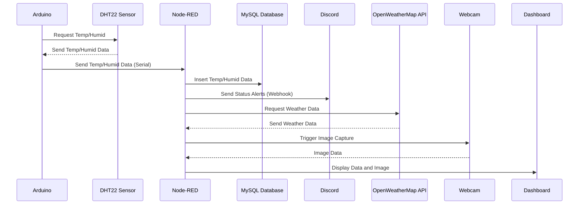

# Fruit Drying System - Project P72H

## Overview

This project is a system for monitoring and controlling a fruit drying process. It utilizes an Arduino for collecting temperature and humidity data, a webcam for visual monitoring, Node-RED for data processing and flow management, a MySQL database for data storage, and Discord webhooks for status alerts. The system also integrates external weather data via API.

## Architecture

The system architecture can be visualized as follows:

## Components

- **Arduino**: Reads temperature and humidity from DHT22 sensor and controls a servo motor and NeoPixels.
  - `arduino/code_read_V1.ino`: Basic DHT22 sensor reading.
  - `arduino/code_read_V1_1/code_read_V1_1.ino`: Advanced version with servo and NeoPixel control based on sensor data.

- **Node-RED**: Visual tool for wiring together hardware devices, APIs, and online services.
  - `node_red/flows.json`: Defines the data flow, including data collection, database interaction, and alerts.
  - [`node_red/insert into mysql.js`](https://github.com/cbaie9/projet72_fruitsec/blob/main/node_red/insert%20into%20mysql.js): Function to format and insert sensor data into the MySQL database.
  - `node_red/recup_humid.js`, `node_red/recup_temp.js`: Functions to extract humidity and temperature from the database query results.
  - `node_red/txt_process.js`: Function to process sensor values and determine the system status.

- **MySQL**: Database for storing sensor data.
  - `sql/P72H_model.mwb`, `sql/P72h_updated.mwb`: MySQL Workbench models of the database schema.
  - `sql/database_export_prod.sql`, `sql/updated_database_prod.sql`: SQL scripts for creating the database and tables.
  - `sql/inject_value_into_bdd.sql`: SQL script to insert sample data.
  - `sql/read_all.sql`: SQL script to read all data from the `capteurs_info` table.

- **Webcam**: Provides visual monitoring of the fruit drying process. Images are captured and displayed on the Node-RED dashboard.

- **Discord**: Used for sending status alerts via webhooks.

- **OpenWeatherMap API**: Retrieves external weather data for additional context.

- **Linux scripts**: Used to set up the server.
  - `linux/installl.sh`: Installation script.
  - `linux/vsftpd.conf`: vsftpd configuration file.

## Setup

### Hardware Setup

- Connect the DHT22 sensor to the Arduino.
- Connect the webcam to the system.
- (If applicable) Connect servo and NeoPixels to the Arduino.

### Software Installation

1. Install the required software on the Linux system using `linux/installl.sh`.
2. Configure the MySQL database using the SQL scripts in the `sql/` directory.
3. Import the Node-RED flows from `node_red/flows.json`.
4. Configure the serial port in Node-RED to match your Arduino's port (check the serial-port config node).
5. Add your OpenWeatherMap API key in the Node-RED flow where the "weather v2" HTTP request node is.
6. Add your Discord webhook URL to the "Discord webhook" node.

### Arduino Code

Upload the appropriate Arduino code (`arduino/code_read_V1.ino` or `arduino/code_read_V1_1/code_read_V1_1.ino`) to the Arduino board.

## Data Flow

1. The Arduino reads temperature and humidity data from the DHT22 sensor.
2. The Arduino sends the data to Node-RED via the serial port.
3. Node-RED parses the data and inserts it into the MySQL database.
4. Node-RED retrieves weather data from the OpenWeatherMap API.
5. Node-RED captures images from the webcam.
6. Node-RED processes the sensor data and sends status alerts to Discord via webhooks.
7. All data is displayed on a Node-RED dashboard.

## Configuration

- **MySQL Database**: Update the database connection details in Node-RED (in the MySQL database config node) to match your MySQL setup.
- **Serial Port**: Configure the serial port in Node-RED to match your Arduino's port.
- **OpenWeatherMap API Key**: Add your API key in the Node-RED flow.
- **Discord Webhook URL**: Add your Discord webhook URL in the Node-RED flow.